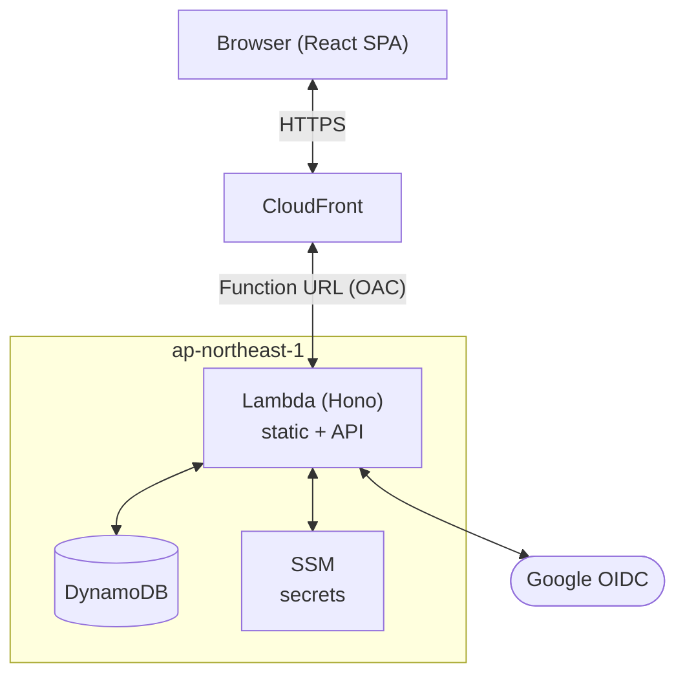

# はなカウンタ（AWS）

## アーキテクチャ

```mermaid
flowchart TB
    Browser["Browser (React SPA)"]
    CF["CloudFront"]
    Google(["Google OIDC"])

    subgraph AWS["ap-northeast-1"]
        L["Lambda (Hono)<br/>static + API"]
        DDB[("DynamoDB")]
        SSM["SSM<br/>secrets"]
        L <--> DDB
        L <--> SSM
    end

    Browser <-->|HTTPS| CF
    CF <-->|"Function URL (OAC)"| L
    L <--> Google
```
